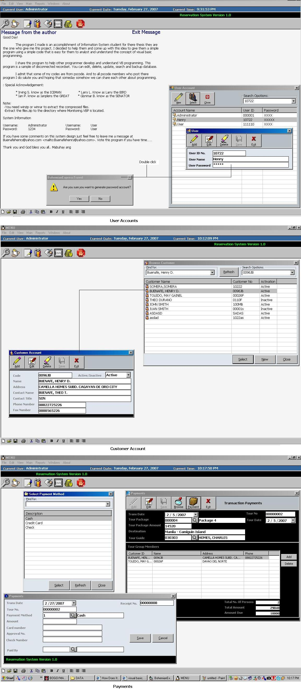



## Reservation System

### Description

The program I made is an accomplishment of Information System student for there thesis they are the one who give me this project. I decided to help them and come up with this idea to give them a simple program using a simple code that is easy for them to analyst and understand the concept of visual basic programming.

I share this program to help other programmer develop and understand VB programming. This program is a sample of disconnected recordset. You can edit, delete, update, search and backup database.

I admit that some of my codes are from pscode. And to all pscode members who post there program I do salute you and hoping that someday somehow we can share each other about programming.
 
### More Info
 

             |
---                |---
**Submitted On**   |2007-02-27 10:13:28
**By**             |[Henry D Buenafe](https://github.com/Planet-Source-Code/PSCIndex/blob/master/ByAuthor/henry-d-buenafe.md)
**Level**          |Intermediate
**User Rating**    |4.7 (52 globes from 11 users)
**Compatibility**  |VB 3\.0, VB 4\.0 \(16\-bit\), VB 4\.0 \(32\-bit\), VB 5\.0, VB 6\.0, VB Script, VBA MS Access, VBA MS Excel
**Category**       |[Complete Applications](https://github.com/Planet-Source-Code/PSCIndex/blob/master/ByCategory/complete-applications__1-27.md)
**World**          |[Visual Basic](https://github.com/Planet-Source-Code/PSCIndex/blob/master/ByWorld/visual-basic.md)
**Archive File**   |[Reservatio2050572272007\.zip](https://github.com/Planet-Source-Code/henry-d-buenafe-reservation-system__1-68003/archive/master.zip)

